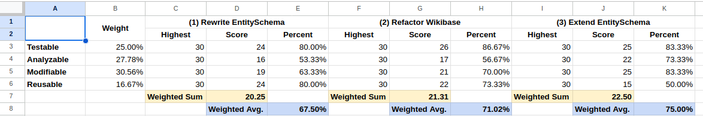

# 0001 Extend Entity Schema to support additional “traits”

## Status

Accepted (2023-02-14)

## Context

In the past, the Wikidata/Wikibase team developed the EntitySchema extension
specifically to register an EntitySchema namespace, add its page content
handler, and various special pages that enable creating Entity Schemas, editing
their terms (labels, descriptions, aliases) and providing their raw ShExC
representation.

Although Entity Schemas relate to Wikibase entities by name and purpose, the
implementation of the EntitySchema extension at the time of this decision is
completely decoupled from Wikibase, and the concept of Entities that it adds to
MediaWiki. Thus, a MediaWiki instance can theoretically operate only with the
EntitySchema extension, and without the Wikibase extension installed.

Keeping EntitySchema separate from Wikibase, and the idea of an Entity it
provides altogether, was a conscious decision to not marry its
implementation to the inherent complexity of Wikibase itself. As well as an
attempt to avoid overloading EntitySchema with unnecessary functionality so that
its ongoing implementation could be done iteratively and in a more flexible,
organic manner, to answer user's needs as they are brought to us.

In order to continue developing the EntitySchema extension, and implement
additional features to extend the user workflows supported by this extension,
we examined three different approaches.

### Register EntitySchema as an Entity Type

* Rewrite the EntitySchema extension to work with Wikibase Entity type
registration

* The bulk of work will be done in the EntitySchema extension’s codebase
itself, but some changes in Wikibase might be required

#### Benefits

* As most of this functionality is technically already implemented in Wikibase,
we might not need to write a lot of new code to support the workflows detailed
by the problem statement

* This approach would follow suit with how WikibaseLexeme and MediaInfo
implement additional concepts for Wikibase

#### Risks

* Registering an entity type would mean that a lot of additional implementation
details and concerns that are not necessarily in the scope of the initial
product requirements would creep into it.

* This approach relies on a heavy degree of coupling between the two
extensions; however, the way Wikibase is currently implemented is not
necessarily maintainable and would most likely change in the coming future,
once ownership of its various components is clarified.

* Coupling the two extensions would also introduce a fair share of complexity
into an otherwise relatively uncomplicated and understandable system and
codebase.

* To implement this approach, we would have to rely on specific knowledge and
familiarity with Wikibase that not all team members share or have experience
in. This could lead to a high degree of context shift for the newer team
members who are not familiar with Wikibase’s unique architecture.

* There are no guarantees that we would be able to complete this
implementation only by rewriting the EntitySchema extension itself alone, and
that some changes would need to be made in WikibaseRepo.

* We will have to migrate, or create a compatibility layer for some 300
Entity Schemas already available on Wikidata.

### Enable registration of particular "traits" in Wikibase

* Create a new, additional API layer in Wikibase itself, to allow the extension
of functionality to already registered MediaWiki content handlers

* The bulk of work will be done in the Wikibase extension’s codebase itself,
with a few additions to the EntitySchema extension

#### Benefits

* Extends on the work formerly done on the EntitySchema extension while still
relying on functionality and code in Wikibase without having to recreate those
from scratch.

* Allows us to start rethinking some parts of Wikibase code that serve as pain
points in understandability and maintainability.

#### Risks

* There are still plenty of implementation details to be ironed out.
Particularly with regard to which API we would use to expose those traits we
identify as useful in Wikibase. A proof of concept is thus required to ensure
we are indeed giving this approach a fair consideration.

* As a large amount of this work will have to be done in Wikibase, this will
create a dependency with a different team for some form of collaboration.
However, that team might not be immediately available to work on these
priorities.

* There still will be dependencies on relatively abstract, rather than use case
specific, functionalities.

* As is apparent from the codebase, this could be another initiative to
implement some ideas about architecture in Wikibase that we will have to commit
to following through on, in order to not exacerbate the current code complexity.

### Extend Entity Schema to support additional “traits”

* Recreate / reuse functionality from Wikibase by copying it or abstracting it
to fit common use-cases within the EntitySchema extension

* This work will probably be done entirely within the EntitySchema extension,
or introduce new composer and npm packages to share abstract logic.

#### Benefits

* Allows the team to come up with implementation decisions that could fit our
particular problem statement more closely.

* Creates a common understanding within the team on a system that we definitely
own, as the learning curve of the existing codebase is low.

* Can be achieved with minimal cross team dependencies

#### Risks

* There is still the risk of introducing complexity into the system, especially
as most of this functionality is already implemented in Wikibase and could
potentially be copied into the EntitySchema extension.

* This approach would most probably be time-consuming, as rewriting or
extracting all these functionalities might take as long as it took to create
them in Wikibase in the first place, with the addition of planning around the
current challenges.

* We might lose Wikibase as the single source of truth for things such as
language fallback and RDF generation. Provided we want to keep those in sync
across our systems.

* In case of pure duplication (not reuse by library extraction) can cause the
Wikidata product, as a whole, to be less maintainable, in the case of having to
develop a new feature or resolving issues in traits that involve UX and UI such
as editable, etc.

### Review and Comparison

For the purpose of clear and transparent decision making, an internal report
detailing the aforementioned risks and benefits of each approach. In addition,
two proof-of-concept changes were made available for team members to be able to
compare approaches:

- An example of simple entity type registration:
https://github.com/addshore/Wikibase/pull/11

- Enabling RDF exports for Entity Schema in the EntitySchema Extension:
https://gerrit.wikimedia.org/r/c/mediawiki/extensions/EntitySchema/+/886827/

- Adding Entity Schema RDF to Wikibase Entity Dumps using MediaWiki hooks:
https://gerrit.wikimedia.org/r/c/mediawiki/extensions/Wikibase/+/886826/

## Decision

After a period of several months where the risk and benefits of each approach
were made available to the team, and as soon as all proof of concepts were
ready for comparison, a poll was performed among the team's engineers in order
to determine which approach to proceed with.

To ensure that we are choosing a sustainable and maintainable approach, using a
system roughly based on the hierarchies from the SQuaRE framework for
software quality, the participating engineers were asked to prioritize between
quality attributes that make up the maintainability of a software system:
testability, analyzability, modifiability and reusability.

After prioritizing these attributes, the engineers ranked each of the approaches
according to how they fulfill each of these characteristics. As a result a rank
of each of the proposed approaches was obtained:

Thus, the highest total score was given to third approach: "Extend Entity
Schema to support additional traits" and it was voted to most fit our
maintainability goals.

## Consequences

As a consequence of this decision, the implementation of each of the
functionalities required by identified product use cases will be based on new implementations within the Entity Schema extension's codebase or by reusing
code extracted from the Wikibase extension into reusable packages.

As was demonstrated in the provided proof of concept, this does not assure that
the EntitySchema extension will remain completely independent from the Wikibase
extension. However, by examining each requirement and product use case on it's
own, the team will be required to investigate the implementation of each
feature as it is prioritized, as well as afforded the opportunity to truly
adapt it to the use case at hand.
