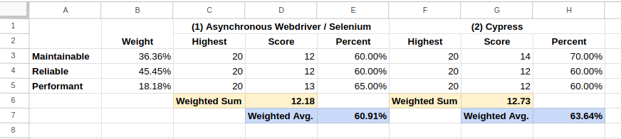

# 0002 Use Cypress for Browser Testing

## Status

Accepted (2023-03-27)

## Context

At the time of making this decision, the framework employed for writing browser
tests in the EntitySchema extension is relatively old, and the small set of
existing browser tests are flaky.

In order to improve the testability of the extension, we investigated two
different options:

1. Write new Selenium/Webdriver tests in the async format and rewrite existing
files incrementally to async
1. Write new Cypress browser tests and rewrite existing files incrementally to
Cypress

The two approaches were compared on 5 different characteristics, and two
proof-of-concept (POC) commits were made to help with the decision process. See
the following links for more information:

- Comparison: https://phabricator.wikimedia.org/T331732#8705071
- POC #1 Asynchronous Selenium / Webdriver:
https://gerrit.wikimedia.org/r/c/mediawiki/extensions/EntitySchema/+/900420/8
- POC #2 Cypress:
https://gerrit.wikimedia.org/r/c/mediawiki/extensions/EntitySchema/+/900638/12

## Decision

After reading the results of the comparison and investigation, participating
engineers were requested to prioritize between different desired attributes for
testing system (Maintainability, Reliability and Performance), and rate each
approach according to the attributes. The results of the poll are provided in
the following table:

As a result of the poll, the second investigated approach to use Cypress to
modernize our browser testing framework emerged as the favorite, and deemed
more well suited for our codebase at this time.

## Consequences

As a result of this decision, we will set-up Cypress as the new browser testing
framework, and we will add tasks to actively rewrite existing browser tests
with Cypress.

While there might be a small expected performance penalty involved with using
Cypress over selenium, we are expecting the maintainability, and potentially
also the reliability of our browser tests to improve as a consequence of this
migration.
