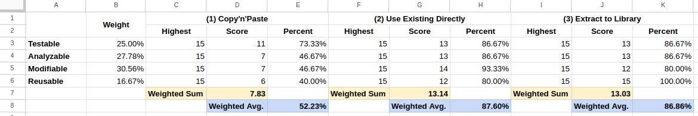

# 0004 Directly use Wikibase Language Fallback

## Status

Accepted (2023-05-17)

## Context

The EntitySchema extension needs to implement language fallback behavior similar
to Wikibase Entity labels in order to support rendering Entity Schema labels in
natural language. This is necessary for various contexts such as page titles,
search results, and item pages.

In order to come to a decision on the best way to do so, we have evaluated
different approaches for implementing the language fallback mechanism:

1. Copy Paste the existing implementation
1. Directly use the Wikibase factory class that instantiates language fallback
chain objects
1. Extract the language fallback mechanism from Wikibase into a reusable library

The three approaches were compared on 4 characteristics, and one proof of
concept commit was made to help with the decision process. See the following
links for more information:

- Comparison: https://phabricator.wikimedia.org/T331999#8779764
- Proof of Concept: https://gerrit.wikimedia.org/r/c/903663

## Decision

After reading the results of the comparison and investigation, participating
engineers were requested to rate each approach according to quality attributes
that make up maintainability testability, analyzability, modifiability and
reusability. The results of the poll are provided in the following table:

As a result of the poll, the second investigated approach to directly use the
Wikibase language fallback chain factory emerged as the favorite and deemed more
maintainable for our team at this point in time.

## Consequences

With this decision, the following consequences arise:

**Easier Maintenance** - By using the existing services directly, we can reduce
the amount of code we need to write and maintain. This leads to improved
development efficiency and reduces the potential for introducing bugs.

**Onboarding Complexity** - Onboarding new team members may require them to
learn the specifics of how the `WikibaseRepo::getLanguageFallbackChainFactory()`
service works. Proper documentation and knowledge sharing will be crucial in
managing this complexity effectively.

**Coupling and Flexibility** - Adopting this approach increases the coupling to
Wikibase. If Wikibase changes its API or behavior, we may need to modify our
code to accommodate those changes. However, it also ensures that our behavior
stays in sync automatically if future modifications are made in Wikibase.

In summary, this decision allows us to utilize the existing services provided by
Wikibase, reducing code maintenance efforts and ensuring synchronization with
future modifications made in other places.

While onboarding complexity and increased coupling are considerations, they can
be managed effectively through proper documentation and knowledge sharing, or
potential future plans with other teams on different approaches.
